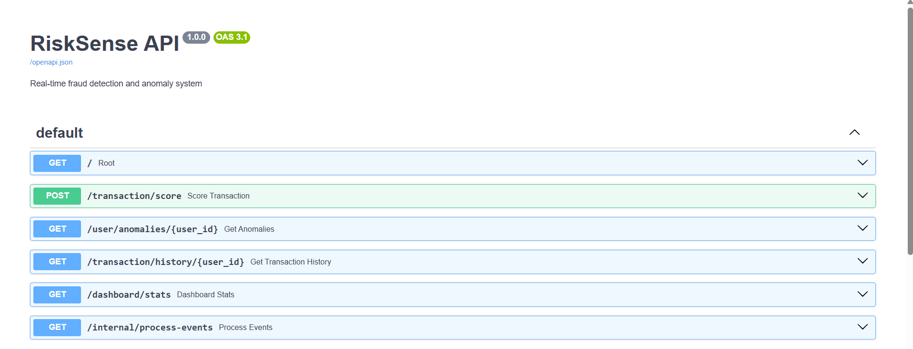
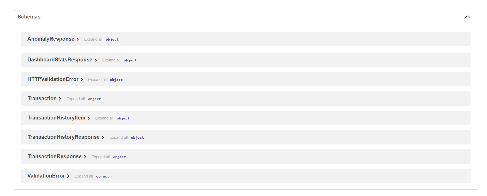
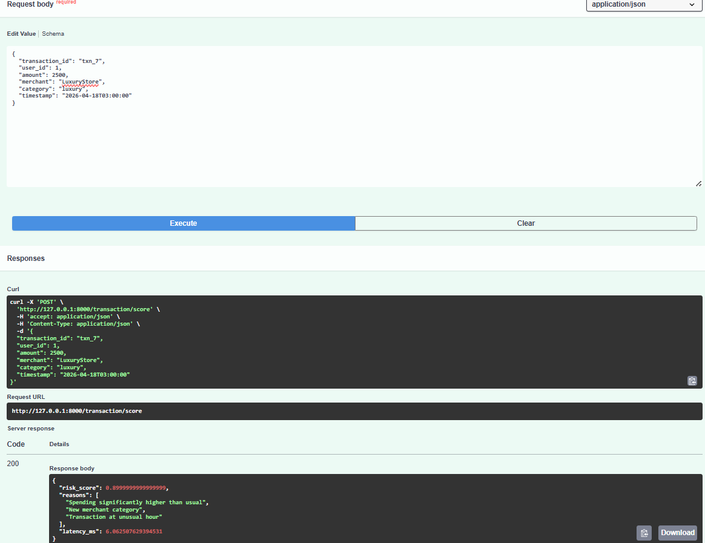
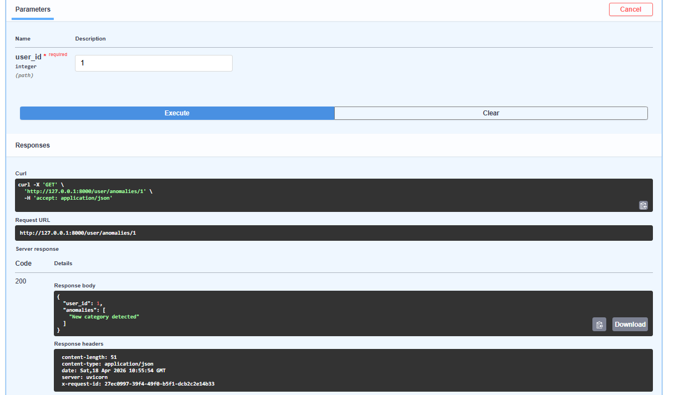
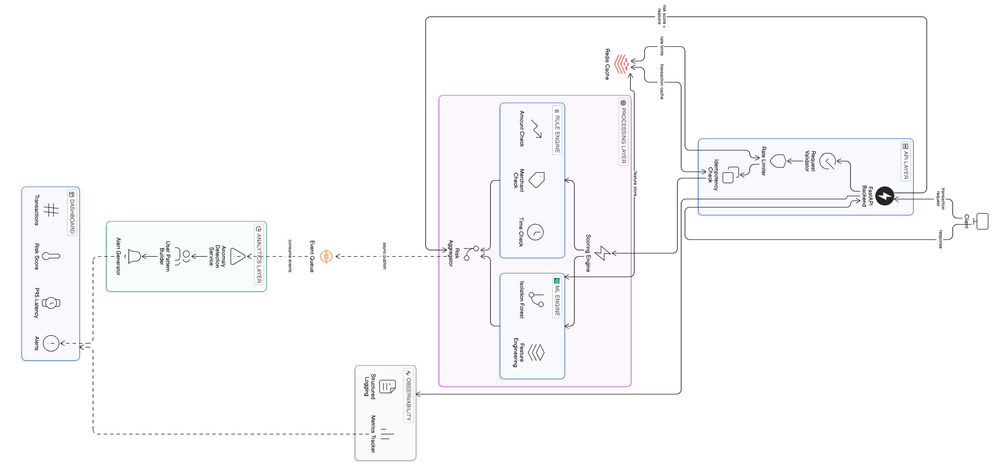

# RiskSense — Real-Time Fraud Detection Backend

## What this is

RiskSense is a backend system that scores financial transactions in real time to detect suspicious activity.

Given a transaction, the goal is to quickly decide whether it looks risky — without slowing down the system.

---

## What it does

* Scores transactions in real time
* Uses a mix of rule-based checks + ML (Isolation Forest)
* Tracks user behavior over time
* Flags unusual patterns (spikes, new categories, odd hours)
* Uses Redis for caching, idempotency, and rate limiting
* Tracks latency (including p95)
* Handles failures with safe fallback responses

---

## Key metrics

* Average response latency: **~40–60 ms**
* p95 latency: **<100 ms under local testing**
* Rate limit: **10 requests/user/minute**
* Cached responses served in: **<10 ms**
* User profile window: **last ~50 transactions tracked per user**

---

## Architecture (high-level)

```id="3p3l12"
Client → FastAPI → Redis (cache + rate limit)
       → Scoring Engine (rules + ML)
       → Response

             ↓
        Event Queue
             ↓
     Anomaly Detection
```

Real-time scoring is kept separate from analytics so the API stays fast.

---

## Tech stack

* FastAPI
* Redis (via Docker)
* Scikit-learn (Isolation Forest)
* Locust (for basic load testing)

---

## Endpoints

* `POST /transaction/score`
* `GET /user/anomalies/{user_id}`
* `GET /transaction/history/{user_id}`
* `GET /dashboard/stats`

---

## Example

### Request

```json id="n4g3qx"
{
  "transaction_id": "txn_4",
  "user_id": 1,
  "amount": 3000,
  "merchant": "Apple",
  "category": "electronics",
  "timestamp": "2026-04-18T13:00:00"
}
```

---

## Screenshots

### API (Swagger)




---

### High Risk Transaction Example



---

### System Metrics




---

### Architecture



---

## Things I focused on

* **Idempotency** — same transaction shouldn’t be processed twice
* **Rate limiting** — prevent abuse using Redis
* **Latency** — tracked average and p95
* **Failure handling** — fallback instead of crashing
* **Separation of concerns** — real-time vs async analytics

---

## Running locally

Start Redis:

```id="q1l9xk"
docker run -p 6379:6379 redis
```

Run backend:

```id="o8t2yz"
python -m uvicorn app.main:app --reload
```

Open:

```id="r2d7uv"
http://127.0.0.1:8000/docs
```

---

## What I’d improve next

* Replace in-memory parts with persistent storage
* Add event streaming (Kafka-style)
* Periodic ML retraining
* Add authentication layer

---

## TL;DR

This project focuses on building a fast, reliable backend system that behaves like a real fraud detection pipeline — not just a demo.
